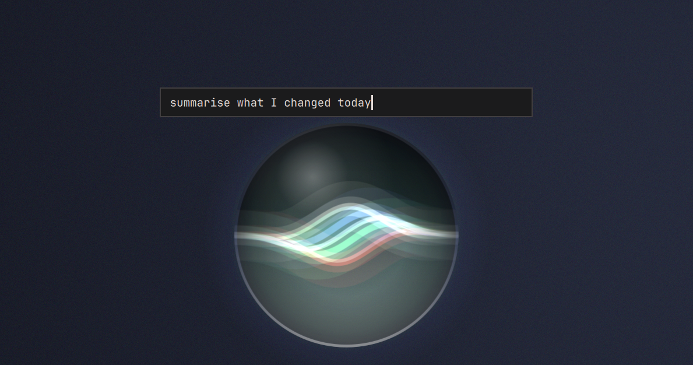
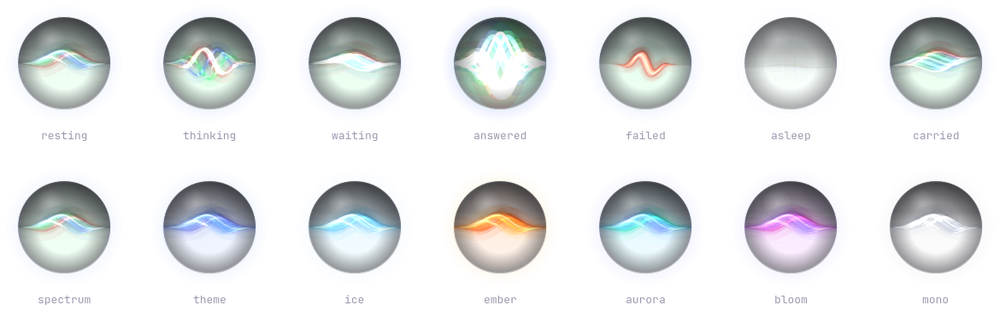
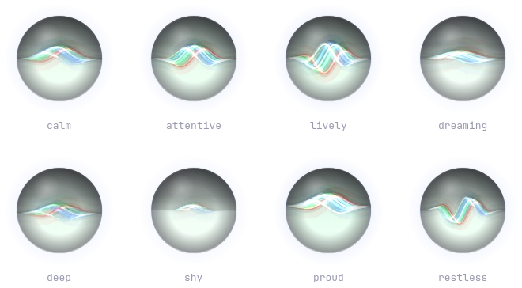

# Omarchy Iris

Your desktop's chief of staff — a small companion that can act on an order,
carry an agent conversation, and stay one click away in the Omarchy bar.

Its default body is **iris**: a glass orb with a band of light running through
it. It is drawn every frame rather than blitted from a spritesheet, so its
glass, its tint and its resting temper are settings — and changing one of them
morphs on screen instead of cutting, which no sheet of drawings can do.



Omarchy Iris is a fork of
[Omarchy Companion](https://github.com/moerdowo/omarchy-companion) with its
character replaced, and Omarchy Companion is itself a fork of
[Omarchief](https://github.com/daventhedude/omarchief). Everything about the
desktop — the service, the bar widget, the agent turns, the placement — comes
down that line; what is new here is the orb. It is built around Omarchy 4's
native plugin architecture: one resident service owns the companion and its
state, while every bar gets a thin view onto that same service. There is one
agent turn, one conversation, and one place in the world no matter how many
monitors you use.

## Install

```bash
omarchy plugin add https://github.com/moerdowo/omarchy-iris.git --enable
```

That is the entire setup. Review Omarchy's unsandboxed-plugin warning, confirm
the install, and keep the declared **right** placement or choose another bar
section. Omarchy then starts the service and adds the one canonical widget
entry. Do not add a second entry to `shell.json`.

Omarchy Iris has its own plugin id, so it installs and runs beside Omarchief
rather than replacing it. It reads none of Omarchief's settings and writes
none of its state.

## Requirements

- **Runtime:** Omarchy 4, including its Quickshell/Hyprland integration,
  `bash`, `python3`, `jq`, and the regular `omarchy-*` helpers. Omarchy Iris installs no
  system package, daemon, hook, or background unit of its own.
- **Unattended orders:** the `bubblewrap` package, 0.9 or newer — the staging
  overlay needs its `--overlay`, which 0.9 added. Install it with your usual
  package manager; this plugin never installs anything and asks for no
  privilege. Also a kernel with unprivileged user namespaces and unprivileged
  overlayfs — both are on by default on Arch and Omarchy. Without any of it the
  companion still works and orders go to the console instead. See
  [The sandbox](#the-sandbox).
- **Orders:** an agent CLI already discovered and configured by Omarchy. Claude,
  Codex, and OpenCode support bubble conversations; other Omarchy agents open
  in the native console scratchpad. The companion and its non-agent controls remain usable
  when no agent is selected.
- **Theme repainting:** ImageMagick's `magick`, included by Omarchy. This is
  only for a *spritesheet* companion you bring yourself; the bundled one is
  drawn, needs nothing, and wears the theme by picking the `Theme accent`
  colour.
- **Development only:** Node.js 22 for model tests; Qt 6 `qmllint`, `jq`, and a
  running Wayland/Omarchy session for integration checks; Python 3, NumPy, and
  ImageMagick for the artwork builders; `rsvg-convert` to redraw the images in
  this README.

## What it feels like

- Click the orb to ask for something. Enter sends; Escape closes.
- Right-click the orb for Omarchy's native console scratchpad.
- On a fresh install it sits at the bottom-right of the active screen; on a
  one-screen laptop that is simply the built-in display.
- Drag it along an edge to choose its home. Push it into an outer edge to
  tuck it away; pull the visible part back out when you want it.
- Open the bar widget for status, the latest answer, quick actions, and
  settings. Middle-click asks from that bar's monitor;
  right-click opens the console there. Its icon is the same character — a ring
  with the band across it, at the temper the orb is actually wearing — drawn in
  the bar's own colour.
- Start a new conversation whenever context should not carry forward.
- The drawn companion watches your pointer while it is over it, and finds
  things to do with itself while nothing is happening — including looking up
  at you.

The orb follows the desktop rather than drawing a second UI language.
Its controls use Omarchy's colors, typography, spacing, panels, focus states,
and bar conventions. It understands multi-monitor virtual coordinates,
Hyprland's outer gap, fullscreen workspaces, the chosen default agent, and
Omarchy's rate-limit records.

## Overview and settings

The popout opens on a compact overview: current agent and state, monitor,
energy, latest answer, console, and only the actions that matter now.
The settings view keeps durable choices together:

- agent and conversation lifetime;
- companion and size;
- home monitor, follow-focus behavior, and fullscreen avoidance;
- idle expressions, theme recoloring, and reduced motion.

Choices are changed in place. The panel stays open, keyboard navigation is
supported, and options that do not apply to the selected pet are left out.

## Agents

Omarchy Iris discovers the agents Omarchy knows about and follows the desktop
default unless you choose another. Claude, Codex, and OpenCode can answer in
the bubble with session-aware follow-ups. The native console is always the
escape hatch for a longer or interactive job.

An order is never retried implicitly. While an agent turn is active, a second
order is refused instead of replacing it, and **Stop** ends that exact turn.
Timeout, cancellation, and process exit are terminal states; an old cleanup
callback cannot affect a later request.

The console is Omarchy's native scratchpad, including its Quake treatment when
the installed Omarchy provides it. It makes the work visible, interactive, and
steerable, and it is launched with no approval flags at all: each agent starts
the way it starts when you type its name, and asks you for itself.

## The sandbox

An unattended order is a sentence typed into a bar widget. It used to become
the selected CLI running as you, with a flag telling it not to ask, held in
check by a paragraph of standing instructions. A paragraph is not a boundary,
so there is one now.

Every bubble order — and every `omarchy-shell iris order …` — runs inside
`bin/iris-warden`, a bubblewrap sandbox:

- **Filesystem.** A read-only system and no real `$HOME`. The agent gets a
  home of its own under this plugin's state directory, with its credential
  file bound in read-only and nothing else: not your SSH keys, not your
  keyring, not your browser profile, not its own settings or hooks.
- **The work directory** is mounted at its own path through an overlay. The
  agent reads and writes it normally and sees its own edits. None of those
  writes have happened.
- **Network.** Its own empty network namespace, with no resolver in it. The
  only way out is a CONNECT proxy on loopback.
- **The desktop.** No Wayland socket, no Hyprland socket, no D-Bus, no SSH
  agent.

Three things can still leave that sandbox, and each one is a question with its
exact subject in it:

| It wants to | You see | You answer |
| --- | --- | --- |
| reach a host that is not its own API | the hostname | Allow · Always · Deny |
| run a command out here | the exact command line | Allow · Deny |
| publish what it wrote | the file count and names | Apply · Discard |

Answer on the companion, in the bar popout with a keyboard, or over IPC:

```
omarchy-shell iris pending     # what is being asked, if anything
omarchy-shell iris allow
omarchy-shell iris deny
omarchy-shell iris sandbox     # enforced, or why not
```

Nothing inside can answer for you: the questions are asked on the other side
of a socket by a process the sandbox cannot reach.

The agent is told all of this at the top of every order, and desktop control
is given to it as one command — `iris-do hyprctl dispatch …`,
`iris-do omarchy theme set …` — so it works with the boundary rather than
spending your turn discovering it. Exit code 77 means you said no.

`sandboxHosts` in this plugin's settings adds standing exceptions to the
network allowlist, for the host you are tired of allowing:

```json
{ "id": "io.github.moerdowo.omarchyiris", "sandboxHosts": ["github.com"] }
```

**Requirements and honest limits.** This needs `bubblewrap`, unprivileged user
namespaces, and unprivileged overlayfs. Iris checks by building a real sandbox
at startup, not by looking for the binary. If it cannot, an unattended order
is **not** quietly run the old way — it goes to the console, where you can see
it and the agent asks for itself, and the bubble tells you why.

**Authentication.** The sandbox binds in the one credential file the selected
agent needs, read-only: `~/.claude/.credentials.json`, `~/.codex/auth.json`, or
OpenCode's `auth.json`. An agent that keeps its credential in the system
keyring instead cannot reach it from in there — the keyring is one of the
things being withheld — and will report itself as signed out. Use file-based
authentication for the agent you point Iris at, or send those orders to the
console.

What this does not claim: it is a boundary around what an agent can *reach*,
not a guarantee about what it will *do* with the API access, work directory
and consented actions you give it. The agent still holds its own credential.
A command you approve runs with your own reach, so read it. And an agent CLI
installed somewhere Iris cannot bind read-only — under some version managers,
for instance — will simply fail to start inside the sandbox rather than
running outside it.

Omarchy Iris does not install agent hooks and does not edit another application's
settings. It may passively read an existing OmaPets-compatible status record
to reflect working, waiting, success, or error in the orb's band. Without
that record, window and rate-limit state provide the fallback.

The plugin makes no network request and sends no telemetry. The agent you
choose has its own network behavior, exactly as it does in a terminal.
Private vulnerability reports follow [SECURITY.md](SECURITY.md).

## Dressing the companion

The **Companion** section of the bar popout has three more choices when the
orb is worn. Each one morphs rather than cuts: a state is a set of numbers
describing one wave, so going from any state to any other is an interpolation
of those numbers, and a temper slides the same way.



**Glass** — five treatments: glass, clear, frosted, halo, bare. `glass` is the
default: a dark crown, light pooled at the floor, a rim and a specular
highlight. `bare` is the band in open air with no sphere at all, which is the
one that stays legible smallest.

**Tint** — six palettes, plus **Theme accent**. `spectrum` is the default and
is the original's own: four layers spread across red, green, blue and white.
The accent has no palette of its own, so one is built from it — the accent, two
neighbours pulled either side of it, and white. Spreading a single hue that way
is not decoration: four layers of one exact colour sum to a grey-white band and
lose the refraction that is the point of having four.

**Resting temper** — eight, worn whenever nothing is happening. A temper is the
band's character at rest: how far it swings, how fast it travels, how far apart
the four layers are pushed, and how bright the glow is.



A temper only ever shows while the orb is resting. A mood with news of its own
overrides it — working opens the spectrum, waiting stops the band travelling and
breathes it, an error goes red and tight, finishing blooms past the rim, and
being carried lets the band lag and slosh.

From a terminal:

```bash
omarchy-shell iris shell frosted
omarchy-shell iris tint theme
omarchy-shell iris temper lively
```

Each lists what it accepts when given something it does not know. A value is
required: Omarchy's IPC has no way to call one of these with nothing, the same
as `pet`.

## While nothing is happening

Left alone, the drawn companion performs. Every so often — rarely enough that
catching it feels like catching something — it does one of these:

| | |
|---|---|
| `notice` | the band lifts towards whoever is at the desk, holds, and settles back |
| `doze` | falls asleep for a while |
| `shimmer` | the spectrum opens and closes across the band |
| `swell` | the band blooms out to the rim and eases back |
| `ripple` | a second harmonic crosses the first and passes through it |
| `spin` | the whole ball turns, light and all, and comes back level |
| `collapse` | the band draws into a point at the centre and grows back out |

`notice` is the one worth watching for. It is the only performance that is a
LOOK rather than a wave: the same machinery the pointer uses, leaning the band
towards you and then handing it back holding nothing. `spin` is the one that
shows what the glass is actually doing — the crown and the pool turn with the
band, because they are the light inside the ball rather than a gradient painted
over it.

None of these is `working`, `waiting`, `error` or `success`. Those four states
are how the plugin tells you something has happened, and a companion that
performed them for its own amusement would be crying wolf.

How often, and how long it rests afterwards, are the existing **activity**
settings — they were built for the spritesheet companions and apply here
unchanged. Anything with news to deliver cuts a performance short, and so does
your hand. To ask for one:

```bash
omarchy-shell iris play notice
omarchy-shell iris play          # whatever it feels like
```

## Bring your own companion

One companion is bundled — the drawn one described above — but the
spritesheet engine this was forked with is all still here, so a pet made for
the ecosystem works. Drop a folder containing `pet.json` and its spritesheet
into:

```text
~/.config/omarchy-iris/pets/<id>/
```

OmaPets folders under `~/.config/omapets/pets/<id>/` are also discovered.
A user pet takes precedence over a bundled one with the same id. Unsafe ids
and relative paths containing traversal are rejected. With more than one
companion installed, a **Companion** picker appears in the settings; with only
the bundled one there is nothing to choose between, so it does not.

Omarchy Iris supports Codex/Petdex-style animated atlases and compact expression
grids. A pet can declare a walk cycle, mood cells, blink, idle performances,
and a themeable hue range. The complete schema is in
[docs/pets.md](docs/pets.md).

## Useful commands

```bash
omarchy-shell iris ask
omarchy-shell iris order "open my calendar"
omarchy-shell iris stop
omarchy-shell iris sandbox
omarchy-shell iris pending
omarchy-shell iris allow
omarchy-shell iris deny
omarchy-shell iris summon
omarchy-shell iris fresh
omarchy-shell iris travel DP-2
omarchy-shell iris tuck on
omarchy-shell iris show
omarchy-shell iris hide
omarchy-shell iris status
omarchy-shell iris shell halo
omarchy-shell iris tint bleu
omarchy-shell iris temper deep
```

Every mutation validates its value before changing state. The JSON status
snapshot lives at
`$XDG_STATE_HOME/omarchy/iris/status.json` (normally
`~/.local/state/omarchy/iris/status.json`) for read-only integrations.
It is output, not the control plane; the bar talks to the service directly.

## Remove

```bash
omarchy plugin remove io.github.moerdowo.omarchyiris
```

Confirm Omarchy's removal prompt. Omarchy Iris installs no hooks, background unit,
or command outside its plugin folder. Its optional local history and
recolored-sheet cache remain in
`$XDG_STATE_HOME/omarchy/iris/` (normally
`~/.local/state/omarchy/iris/`) so an accidental reinstall does not erase
them. They can be removed separately if that history is no longer wanted.

## Develop and verify

```bash
omarchy plugin validate .
node --test tests/*.test.mjs
tools/coldstart-check
```

The cold-start test uses an isolated HOME/XDG environment and a real plugin
manifest plus shell configuration, so an installed user pet cannot mask a
missing bundled asset. Since no spritesheet ships any more, it plants one in
that isolated environment and loads it — a better test of the path a pet
actually arrives by than bundled artwork was.

There is no equivalent of the previous character's port verifier here, and the
reason is worth stating rather than leaving as an absence. That character was a
port of a JavaScript library, so both engines could be run side by side and
compared character for character. This one is a port of a WebGL shader onto a 2D
canvas: there is no shared output to diff, and a check that compared rendered
pixels would be asserting the tuning rather than the geometry. What is checkable
IS checked — the flank taper, the phase spread, the frame the band has to fit,
and that every state paints — and `tests/iris.test.mjs` holds those.

One generator, not run at install time:

```bash
tools/build-preview    # redraws docs/moods.png and docs/tempers.png
```

It needs Qt's `qml` tool, because it draws the sheets with the plugin's own
renderer rather than with a second implementation of it.

Architecture, visual checks, and the release gate are documented in
[docs/development.md](docs/development.md).

## License

MIT. Omarchy Iris is a fork of
[Omarchy Companion](https://github.com/moerdowo/omarchy-companion), which is a
fork of [Omarchief](https://github.com/daventhedude/omarchief), Copyright (c)
2026 Daven Niemann. The orb is a port of the animated `SiriOrb` component on
<https://maia.id/>. No third-party artwork ships: the companions that carried
some were removed, and what they leave behind — along with an open question
about the orb component's own provenance, which is why this repository is
private — is recorded in [THIRD_PARTY_NOTICES.md](THIRD_PARTY_NOTICES.md).

Omarchy Iris is independent. It is not endorsed by Omarchy or by the authors of
the projects it is built from.
